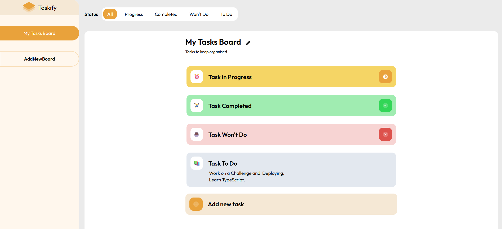

## 📒 Taskify

<div align="center">



> _Welcome to Taskify where your tasks meet simplicity and organization_

[🚀 Live Demo](https://taskify-app-demo.vercel.app/)

[](https://github.com/mhdcraft)
[](https://react.dev/)
[](https://tailwindcss.com/)
[](https://opensource.org/licenses/MIT)

</div>

---

## 🌟 About Taskify

Taskify is a **mini task manager** project built with **React and JSON Server**.
Users can create multiple **boards** to organize their work and add manage any number of tasks within each board.
Each task can have different **statuses** like To Do, In Progress, Completed, or Won't Do, and users can even assign icons to tasks for better visual organization.
The app supports **SPA navigation** using React Router, is fully **responsive**, and leverages **Context + Reducer** for state management to keep everything smooth and efficient.

---

## 🚀 Key Features

🗂️ Multiple Boards: Create as many boards as you need.

✅ Task Management: Add, edit, delete tasks in each board.

🔄 Task Statuses: Tasks can have different statuses: To Do, In Progress, Completed, Won’t Do.

✨ Task Icons: Assign unique icons to tasks for quick visual cues.

🔍 Filtering: Filter tasks in each board based on their status.

📱 Mobile-First Design: Fully responsive on all devices.

⚡️ Context + Reducer: Centralized state management for smooth performance.

🎨 User-Friendly UI: Designed with Tailwind CSS for modern, clean layouts.

---

## 🛠️ Tech Stack

⚛️ React: Frontend framework for building interactive UI.

🚦 React Router DOM: SPA navigation between boards.

⚡️ Context + Reducer: Efficient global state management.

🎨 Tailwind CSS v3: Modern styling with responsive design.

🌐 JSON Server: Simulated backend for task and board data.

---

## 🚀 Getting Started

### Prerequisites:

- Node.js (v14 or higher)
- npm (v6 or higher)

### Installation

1. Clone the repository:

```bash
git clone https://github.com/mhdcraft/frontend-hub.git
```

2. Navigate to the project folder:

```bash
 cd taskify
```

3. Install dependencies:

```bash
npm install
```

4. Run development server:

```bash
npm run dev
```

5. Start the JSON Server:

```bash
npm run server
```

---

## 📜 License

This project is licensed under the [MIT License](./LICENSE)

---

<div align="center">

Made with ❤️, ✨ by [Mohammad Hosseini](https://github.com/mhdcraft)

_Keep your tasks organized, stay productive, and enjoy coding!_ 💻🚀

</div>
