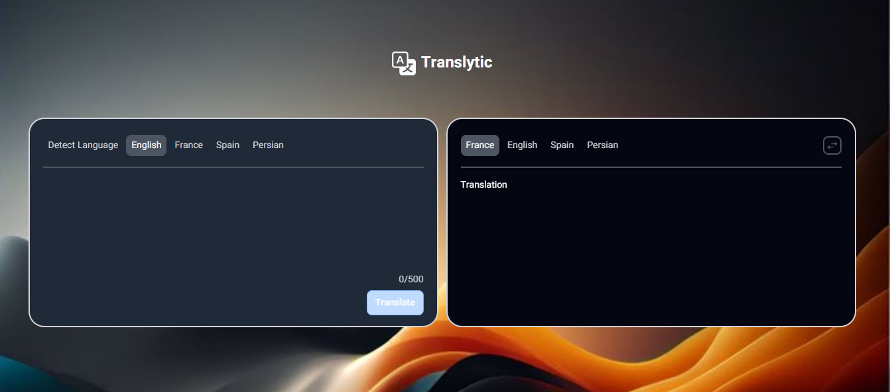

## 🌐 Translytic

<div align="center">



<div align="center">
  
</div>

[🚀 Live Demo](https://traslytic.vercel.app/)

[](https://github.com/mhdcraft)
[](https://react.dev/)
[](https://tailwindcss.com/)
[](https://opensource.org/licenses/MIT)

</div>

---

## 📝 About Translytic

A modern and minimal translation app built with React and Tailwind CSS.
It lets users translate text across multiple languages, listen to accurate pronunciations, and manage translations effortlessly

---

## 🚀 Features

🔍 **Real-time translation** powered by [MyMemory API](https://mymemory.translated.net/doc/spec.php)

🌐 **Multi-language support**: English, Persian, French, Spanish

🔄 **Swap translations**: Quickly switch between source and target languages

🔊 **Text-to-speech**: Listen to the correct pronunciation of your text

📝 **RTL Support**: Automatically adjusts layout for right-to-left languages such as Persian

📋 **Copy to clipboard**: Copy translations with a single click

📱 **Responsive design**: Smooth experience on both desktop and mobile

---

## 🔍 API Used

This project uses the **MyMemory Translation API** to fetch translations in real-time.

---

## ⏳ Development Status

🚧 Still in development: expect regular updates

🌐 Currently supports 4 languages: more coming soon

🛠️ Some features are being improved and will get better in future releases

---

## 🛠 Tech Stack

- **MyMemory API**: Provides real-time translations powering the app

- **React**: Build interactive and dynamic UI components

- **Tailwind CSS**: Utility-first CSS framework for fast and flexible styling

- **Responsive Design**: Mobile-first approach ensuring smooth experience on all devices

- **Font Family**: Vazir for clear and readable Persian typography

---

## 💻 Getting Started

### Installation

1. Clone the repository:

```bash
git clone https://github.com/mhdcraft/frontend-hub.git
```

2. cd to the project directory:

```bash
 cd translytic
```

3. Install dependencies:

```bash
npm install
```

4. Run development server:

```bash
npm run dev
```

---

## 📜 License

This project is licensed under the [MIT License](./LICENSE)

---

<div align="center">

Thanks for trying Translytic! 🌐

Made with ☕️, 🎶 by [Mohammad Hosseini](https://github.com/mhdcraft)

</div>
